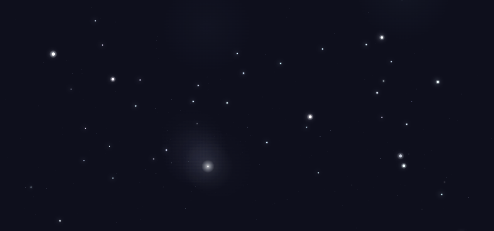
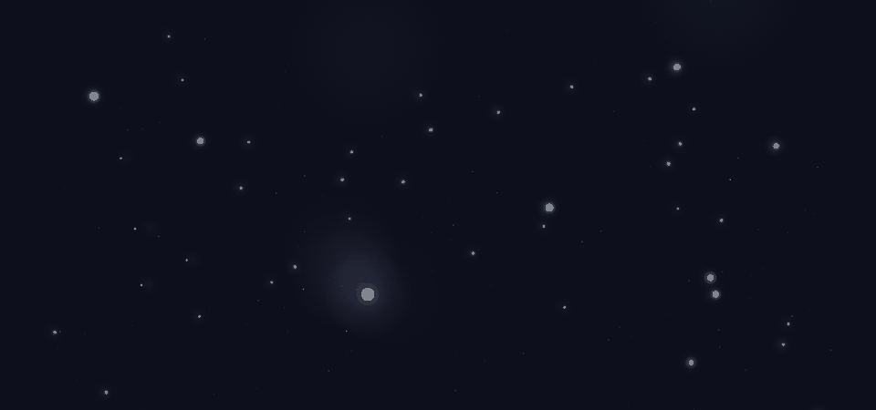

# Particle Love

An interactive generative web experience built around a night sky that remembers.

[**Live Demo →**](https://yupenglab.github.io/particle-love/)  
[**View the source →**](https://github.com/yupenglab/particle-love)



---

> 一个写给一个人的网页。  
> 与其说是一件作品，不如说是一封会呼吸的情书。

## Experience

The page begins in darkness. After the first touch, a single light appears and a layered night sky slowly wakes around it.

From there, the experience is meant to be discovered rather than completed:

- The sky breathes, grows tired, falls asleep, and wakes again.
- Its atmosphere shifts with the hour, with rare moments reserved for particular nights.
- Visits, traces, constellations, and a slow-moving dawn persist in the browser.
- A touch may become a bloom of light, a distant meteor, or simply silence.
- Across one hundred visits, the night moves almost imperceptibly toward sunrise.



## What Makes It Different

Particle Love is deliberately quiet. It does not ask for attention or turn memory into a score.

- **Persistent memory** — the world remembers visits and traces through `localStorage`.
- **Time-aware atmosphere** — the hour and selected dates alter what can appear.
- **Evolving visits** — some changes are designed to unfold over many returns.
- **Generative interaction** — movement, light, particles, and responses are produced in real time.
- **Generated sound** — sparse tones and ambience are synthesized at runtime rather than played from audio files.
- **Long-form hidden behavior** — rare events reward patience without presenting a checklist.

## Technical Notes

- **Rendering:** native HTML5 Canvas with layered depth, soft light, and high-DPI scaling
- **Motion:** spring return, damping, pointer fields, ambient wind, and procedural actors
- **State:** `localStorage` for visit progress, traces, constellations, and long-term changes
- **Audio:** Tone.js 14.8.49 and the Web Audio API, unlocked by the first real interaction
- **Interaction:** mouse, pointer, keyboard, and touch input, with mobile-specific behavior
- **Delivery:** plain HTML, CSS, and JavaScript; no framework and no build step

## Details / Hidden Behaviors

The work contains more than it explains. Some responses are intentionally rare, and several moments are designed to be encountered only after returning.

<details>
<summary>Preview and testing controls</summary>

These query parameters are intended for reviewing states without rewriting browser history:

- `?fresh=1` — reset Particle Love's stored experience state
- `?night=N` — preview a specific visit count
- `?hour=H` — preview a specific hour
- `?bday=1` — preview the annual night
- `?sunrise=1` — preview the hundredth-visit sunrise

</details>

## Running Locally

Clone the repository and serve the directory with any local static server:

```bash
git clone https://github.com/yupenglab/particle-love.git
cd particle-love
python -m http.server 8000
```

Then open `http://localhost:8000/`.

The first click, tap, or key press unlocks the audio system. Tone.js is loaded from a CDN, so its musical layer requires a network connection.

## Philosophy

这不是一个会主动讨好谁的页面。它更像一片安静的星野——会呼吸，会记得来过的人，会在被触碰时，用极克制的方式回应。

它的脾气只有四句：说得极少，记得极多，从不先开口，从不让人愧疚。

它一生只说七句话，每句只说一次。其中没有一个「我」字，也没有一个「爱」字。

## Credits

- [Tone.js](https://tonejs.github.io/) for browser-based music synthesis
- Built with native browser APIs and no application framework

---

*Built with love, for 范晓语.*
